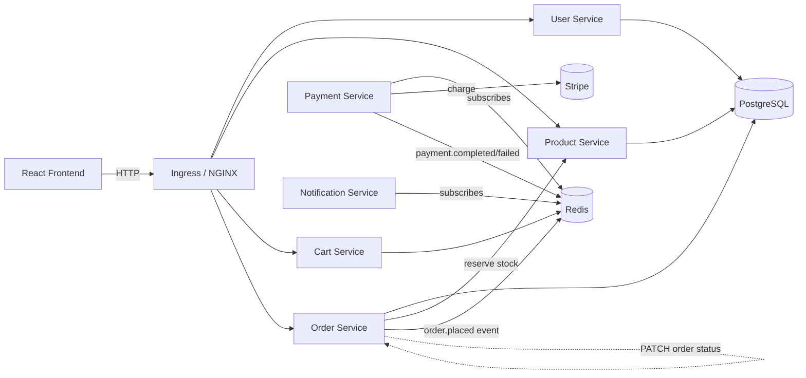

# ShopSphere

A cloud-native e-commerce platform built as a set of independently deployable microservices, with production-style DevOps tooling around it: Terraform-provisioned infrastructure on both AWS and Azure, GitOps deployments via Argo CD, canary rollouts with automated rollback, and full observability.

> Built to demonstrate end-to-end ownership of a system — from application code to the infrastructure and delivery pipeline that ships it.

## Architecture



Services talk over synchronous REST (order service checks stock with product service) and asynchronous Redis pub/sub for the checkout flow (order → payment → notification), so a slow or failed downstream step doesn't take the whole checkout transaction down with it.

## Services

| Service | Stack | Responsibility |
|---|---|---|
| `user-service` | Flask, PostgreSQL, JWT | Signup/login, issues the JWTs the other services trust |
| `product-service` | Flask, PostgreSQL, Prometheus exporter | Product catalog, stock levels, `/healthz` + metrics endpoint |
| `cart-service` | Flask, Redis | Per-user cart, authenticated via JWT |
| `order-service` | Flask, PostgreSQL, Redis | Places orders, reserves stock via product-service, publishes order events |
| `payment-service` | Python, Redis, Stripe | Subscribes to order events, charges via Stripe, publishes the result |
| `notification-service` | Python, Redis | Subscribes to payment events, notifies the user |
| `frontend` | React 19, Vite, Mantine, Redux Toolkit, React Router | Storefront, cart, checkout, admin panel |

## Infrastructure & delivery

- **Terraform** — separate stacks under `infra/aws` (VPC, EKS, ECR) and `infra/azure` (VNet, AKS, ACR, a delegated PostgreSQL subnet), so the same application can be provisioned on either cloud.
- **Kubernetes via Kustomize** — a shared `k8s/base` with `overlays/dev`, `overlays/prod`, and `overlays/azure` for environment-specific image tags and namespaces.
- **Argo Rollouts** — canary deployments for the core services (20% traffic → pause → 100%), gated by a Prometheus `AnalysisTemplate` that checks live error rate before promoting the rollout.
- **Argo CD** — GitOps `Application` manifests with automated sync and self-heal, so `main` is the source of truth for what's running in `shopsphere-prod`.
- **NetworkPolicies** — default-deny ingress at the namespace level, with explicit allow rules per service-to-service dependency.
- **Observability** — Prometheus metrics via `prometheus-flask-exporter` and custom `PrometheusRules`, plus Loki/Promtail for log aggregation.
- **CI (GitHub Actions)** — lints and runs the pytest suite for each service against a real Postgres container, then builds and pushes images to both ECR and ACR on merge to `main`.

## Local development

### Run a single service
```bash
cd services/product-service
docker compose up --build            # Postgres + product-service on :5000
```

### Run the whole system on kind
```bash
# 1. cluster + ingress + Argo Rollouts
kind create cluster
kubectl apply -f https://raw.githubusercontent.com/kubernetes/ingress-nginx/main/deploy/static/provider/kind/deploy.yaml
kubectl create namespace argo-rollouts && kubectl apply -n argo-rollouts -f https://github.com/argoproj/argo-rollouts/releases/latest/download/install.yaml

# 2. images + deploy (see Makefile)
make build-local STRIPE_PK=pk_test_...     # your Stripe *publishable* key
make kind-load
make deploy-dev

# 3. open http://localhost  (ingress on port 80)
```
Dev secrets live in `k8s/overlays/dev/kustomization.yaml` and are safe placeholder values.
To exercise payments locally, patch `STRIPE_SECRET_KEY` there with a Stripe **test** key and don't commit it.

### Frontend only
```bash
cd frontend
cp .env.example .env                 # set VITE_STRIPE_PUBLISHABLE_KEY
npm install && npm run dev           # proxies /api/* to http://localhost:8080
```

### Tests
```bash
make test                            # needs Postgres (shop/shoppass) on :5432 and Redis on :6379
```

## API

All public routes are served under `/api/*` by the ingress (prefix stripped), so they never collide with SPA routes.

| Method | Path | Auth | Service |
|---|---|---|---|
| POST | `/api/signup`, `/api/login` | – | user-service |
| GET | `/api/products`, `/api/products/{id}` | – | product-service |
| POST | `/api/products` | JWT | product-service |
| GET/POST/DELETE | `/api/cart` | JWT | cart-service |
| GET/POST | `/api/orders` | JWT | order-service |
| PATCH | `/products/{id}/stock`, `/orders/{id}/status` | `X-Internal-Token` (not routed publicly) | internal |

Checkout flow: frontend creates a Stripe PaymentMethod → `POST /api/orders` → order-service prices items, reserves stock (rolled back if any item fails), stores the order, publishes `order.created` → payment-service charges the real total via Stripe → `PATCH /orders/{id}/status` → `payment.completed|failed` → notification-service.

## Deploying to a cloud

1. `cd infra/aws` (or `infra/azure`), configure the remote-state backend in `versions.tf`, `terraform apply`.
2. Put the `ecr_repo_prefix` / `acr_login_server` output into `k8s/overlays/{prod,azure}/kustomization.yaml` and into the GitHub secrets listed in `.github/workflows/ci.yml`.
3. Create the runtime secret out-of-band (never commit it):
   ```bash
   cp k8s/overlays/prod/secrets.env.example k8s/overlays/prod/secrets.env   # git-ignored; fill in real values
   kubectl -n shopsphere-prod create secret generic shopsphere-secrets --from-env-file=k8s/overlays/prod/secrets.env
   ```
4. `kubectl apply -f argocd/shopsphere-app.yaml`. Every merge to `main` builds, scans and pushes all seven images and commits the new SHA tag to the overlays; Argo CD syncs it.

## Security notes

- No secret has a default in code: every service refuses to start without `JWT_SECRET` (and `INTERNAL_API_TOKEN` / `STRIPE_SECRET_KEY` where used).
- Passwords are hashed with Werkzeug's salted PBKDF2/scrypt, never plain SHA-256.
- Service-to-service endpoints (stock reservation, order status) require a shared `X-Internal-Token` and are not exposed through the ingress.
- NetworkPolicies default-deny ingress; only the ingress controller, Prometheus and declared dependencies can reach each pod.
- Secrets are never committed. If anything sensitive was ever pushed to this repo in the past, treat it as compromised and rotate it.

## License

MIT
